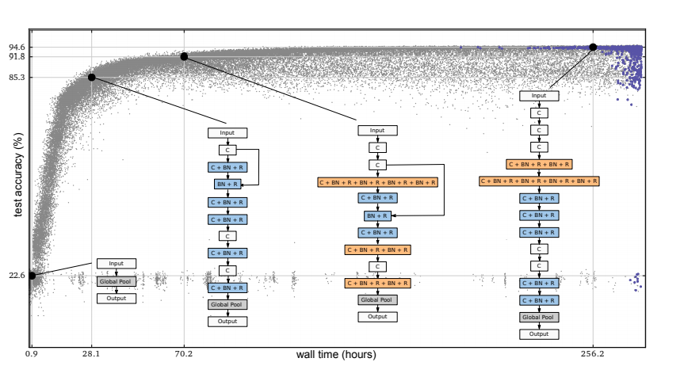
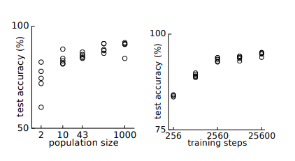
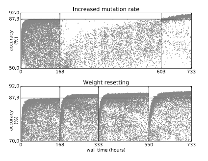
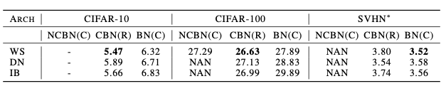
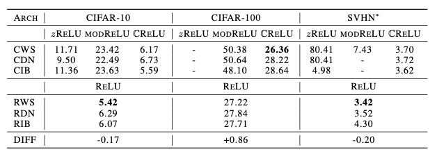

# Large-Scale Evolution of Image Classifier
## Main contributions
Minimize human participation by propose evolutionary algorithms to discover such networks
automatically
## Introduction
### Evolve models of image classifiers, given enough computational power
*  CIFAR-10 dataset & CIFAR-100 dataset: use slightly-modified known evolutionary algorithms
and scaled up the computation to unprecedented levels with a set of novel and
intuitive mutation operators.
* CIFAR-10 had a test accuracy
with $µ$ = $94.1$%, $σ$ = $0.4$% @ $9×10^{19}$ FLOPs and CIFAR-100 had a test accuracy of $77.0$% @ $2×10^{20}$ FLOPs.

### Ways to Scale Evolution
* Starting with no convolutions, the algorithm evolve complex convolutional neural networks while navigating a fairly unrestricted search space: no fixed depth, arbitrary skip connections, and numerical parameters that have few restrictions on the values .
## Methods
###  Evolutionary Algorithm
* Automatically search for high-performing neural network architectures:
  * Evolve a population of models by each model or individual is a trained architecture.
  *  The model’s accuracy on a separate validation dataset is a measure of the individual’s quality or fitness.
  *  During each evolutionary step, a computer (a worker) chooses two individuals at random from this population and compares their fitnesses.
  *  The worker creates a copy of the parent and modifies this copy by applying a mutation as the child.
  *  The worker trains the child, evaluates it and puts it back. The child free to act as a parent.
  

### Encoding and Mutations
  *  Individual architectures are encoded as the graph that as the DNA,  the vertices represent rank-3 tensors or activations, The activations are applied can be batch-normalization with rectified linear units (ReLUs) or plain linear units.
  *  The graph’s edges represent identity connections or convolutions and contain parameters defining the convolution’s properties.
  *  Resolution is done by choosing one of the incoming edges as the primary one. The activations coming from the non-primary edges are reshaped through zerothorder interpolation
  *  In each reproduction event, the worker picks a mutation at random from a predetermined set contains the following mutations:
     * ALTER-LEARNING-RATE
     * IDENTITY (effectively means “keep training”)
     * RESET-WEIGHTS
     * INSERT-CONVOLUTION (inserts a convolution at a random location in the “convolutional backbone”)
     * REMOVE-CONVOLUTION
     * ALTER-STRIDE (only powers of 2 are allowed)
     * ALTER-NUMBER-OF-CHANNELS (of random conv)
     * FILTER-SIZE (horizontal or vertical at random, on random convolution, odd values only)
     * INSERT-ONE-TO-ONE (inserts a one-to-one/identity connection, analogous to insert-convolution mutation)
     * ADD-SKIP (identity between random layers)
     * REMOVE-SKIP (removes random skip)
   * These specific mutations were chosen for their similarity to the actions that a human designer may take when improving an architecture
### Initial Conditions
   *    Each initial individual constitutes just a single-layer model with no convolutions to make the discoveries by itself 
   *    The experimenter contributes mostly through the choice of mutations that demarcate a search space
### Weight Inheritance
*  The children inherit the parents’ weights whenever possible, some mutations preserve all the weights, some preserve none, and most preserve some but not all
## Experiments and Results
**Question**: 
* Can a simple one-shot evolutionary process start from trivial initial conditions and yield fully trained models that rival hand-designed architectures?
* What are the variability in outcomes, the parallelizability, and the computation cost of the method?
  

  Progress of an evolution experiment. Each dot represents an individual in the population. Blue dots (darker, top-right) are alive. The rest have been killed. The four diagrams show examples of discovered architectures. These correspond to the best individual (rightmost) and three of its ancestors. The best individual was selected by its validation accuracy. Evolution sometimes stacks convolutions without any nonlinearity in between (“C”, white background), which are mathematically equivalent to a single linear operation. Unlike typical hand-designed architectures, some convolutions are followed by more than one nonlinear function (“C+BN+R+BN+R+...”, orange background)

#### Repeated the experiment 5 times to get a sense of the variability in outcomes
Across all 5 experiment runs, the best model by validation accuracy has a testing accuracy get close ($µ= 94.1$%, $σ= 0.4$)

The total amount of computation across all 5 experiments was $4×10^{20}$ FLOPs (or $9×10^{19}$ FLOPs on average per experiment). Each experiment was distributed over 250 parallel workers

## Analysis
### Meta-parameters
Since not all experiments reach the highest possible value, some populations are getting “trapped” at inferior local optima. This entrapment is affected by two important meta-parameters. These are the population size and the number of training 
steps per individual
### Effect of population size
- In particular, that a population of size 2 can get trapped at very low fitness values. Some intuition about this can be gained by considering the fate of a super-fit individual
-  If the super-fit individual wins once, it will win every time. After the first win it will produce a child that is one mutation away
-  This is only a rough argument to heuristically suggest why a population of size 2 is easily trapped
  

The left Fig empirically demonstrates a benefit from an increase in population size
### Effect of number of training steps
The number T of training steps for each individual. Accuracy increases with T
### Escaping local optima
- Increasing the mutation rate 
- Resetting all the weights of a population
- Work well but are quite costly
  
    

---------
# DEEP COMPLEX NETWORKS

## Main contributions
- Provide the key atomic components for complex-valued deep neural networks and apply them to convolutional feed-forward networks and convolutional LSTMs
- Rely on complex convolutions and present algorithms for complex
batch-normalization, complex weight initialization strategies for complex-valued
neural nets and use them in experiments with end-to-end training schemes

## Introduction

**Observation**: 
- Learning explicit residuals of layers helps in avoiding the **vanishing gradient** problem and provides the network with an easier optimization problem 
- Standardizing the activations of intermediate layers in a network across a minibatch acts as a powerful regularizer as well as providing faster training and better convergence properties
- Using complex numbers in RNNs allows the network to have a richer representational capacity
- A general formulation for the building components of complex-valued deep neural networks:
  * A formulation of complex batch normalization
  * Complex weight initialization
  * A comparison of different complex-valued ReLU-based activation functions
  * A state of the art result on the MusicNet multi-instrument music transcription dataset
  * A state of the art result in the Speech Spectrum Prediction task on the TIMIT dataset
## COMPLEX BUILDING BLOCKS
### COMPLEX CONVOLUTION
$W = A + iB$

$h = x + iy$

Convolution operator:
$$W∗h= (A∗x−B∗y)+i(B∗x+A∗y)$$

where $A$ and $B$ are real matrices and $x$ and $y$ are real vectors 

### COMPLEX-VALUED ACTIVATIONS
#### ModReLU:
$$modReLU(z) = ReLU(|z| + b) e^{iθz} = \quad(|z|+b)\frac{z}{|z|} \text{if}  |z|+b≥0,$$
$$otherwise = 0$$

$z ∈ C$, $θz$ is the phase of $z$, and $b$ $∈$ $R$ is a learnable parameter

#### CReLU AND zRELU

$$CReLU(z) = ReLU(R(z)) + i ReLU(I(z))$$

CReLU satisfies the Cauchy-Riemann equations when both the real and imaginary parts are at the same time either strictly positive or strictly negative
$$ zReLU(z) = z \text{if θz ∈ [0, π/2]},$$

$$otherwise = 0$$
#### COMPLEX BATCH NORMALIZATION

Scaling the data by multiplying the 0-centered data $(x − E[x])$ by the inverse square root of the $2×2$ covariance matrix $V$ :

$$\tilde x=(V)^{-1/2} − (x−E[x])$$

The complex batch normalization is defined as:

$$ BN (\tilde x) = γ \tilde x + β$$

$γ$ is  scaling parameter (2 × 2 positive semi-definite matrix)

#### COMPLEX WEIGHT INITIALIZATION
A complex weight has a polar form as well as a rectangular form:
$$W =|W|e^{iθ} = R\{W\}+i I\{W\}$$

$θ$ and $|W |$ are respectively the argument (phase) and magnitude of $W$

#### COMPLEX CONVOLUTIONAL RESIDUAL NETWORK
- Learn the initial imaginary component of input by performing the operations present within a single real-valued residual block
  $$ BN →ReLU →Conv→BN →ReLU →Conv$$

### EXPERIMENTAL RESULTS 
- Train comparable real-valued Neural Networks using the standard ReLU. tested complex models with the $CReLU$, $zReLU$ and $modRelu$
-  Use a cross entropy loss for both real and complex models
-  Consider architectures that trade-off model depth (number of residual blocks per stage) and width (number of convolutional filters in each layer) given a fixed parameter budge by build 3 different models - wide and shallow (WS), deep and narrow (DN) and in-between (IB)
     *  WS architecture starts with 18 real filters per convolutional layer and 14 blocks per stage
     *  he DN architecture starts with 14 real filters and 23 blocks per stage 
     *   IB architecture starts with 16 real filters and 18 blocks per stage
- All models (real and complex) were trained using the backpropagation algorithm with Stochastic Gradient Descent with Nesterov momentum (Nesterov, 1983) set at 0.9
  

    
    Classification error on CIFAR-10, CIFAR-100 and SVHN* using different normalization strategies. NCBN, CBN and BN stand for a Naive variant of the complex batch-normalization, com- plex batch-normalization and regular batch normalization respectively

    
    Classification error on CIFAR-10, CIFAR-100 and SVHN* using different complex activa- tions functions (zReLU, modReLU and CReLU). WS, DN and IB.The prefixes R & C refer to the real and complex valued networks respectively.

 Complex representation outper- formed the real one (wide and shallow on CIFAR-100), combining a real-valued convolutional filter with a complex batch normalization improves the accuracy of the real-valued convolutional model